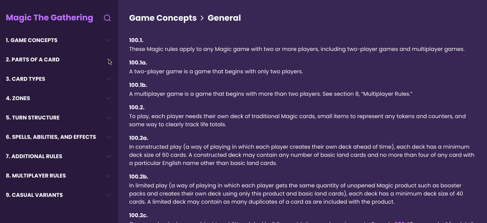

# Magic The Gathering 

## Project overview

A project for Reaktor Junior Developer Recruitment 2021 in which the task is to build an interactive, hyperlinked rulebook application for a card game, of which rules are described in txt file. You can read the complete requirements here. 🔥 

<br/>



<br/>

## Running the app

To start the app in local environment:

- Run the client:

```bash
npm run start
```

Then go to http://localhost:3000 and see the app.

- To create production build

```bash
npm run build
```

## Project structure

```bash
├── config/webpack
├── dist
├── src
│   ├── components
│   ├── contexts
│   ├── data
│   ├── styles
│   ├── utils
│   └── views
├── README.md
├── package.json
└── .gitignore
```


